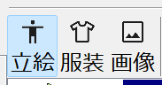

# 立ち絵ツール

## 立ち絵ツールについて

立ち絵ツールは、**PSD ファイルを AviUtl2 でそのまま使用できるようにするためのツール**です。  
キャラクター立ち絵用の PSD を登録することで、AviUtl2 上で扱いやすい形式に変換・管理します。

### 基本的な役割

このツールの主な役割は、次の通りです。

- PSD ファイルを AviUtl2 用の立ち絵データとして登録する  
- 表情やパーツ構成を解析し、AviUtl2 で使用できる状態にする  

従来必要だった **ANM ファイルの作成は不要** で、  
PSD ファイルをそのまま扱えることが大きな特徴です。

### 表情登録について

立ち絵ツールでは、表情の登録作業を **手動で行う必要はありません**。

PSD ファイルを登録すると、

- 目
- 口
- 眉 などの表情パーツ

を自動的に解析し、  
使用可能な表情として登録します。

そのため、表情ごとに設定を作成する必要はなく、  
初心者の方でもすぐに使い始めることができます。

### PSDToolkit 非対応ファイルについて

立ち絵ツールは、**PSDToolkit に対応していない PSD ファイル** でも使用できます。

PSDToolkit 非対応のファイルであっても、

- レイヤー構造を解析
- 表情パーツを自動判別

することで、表情の自動解析に対応しています。

既存の PSD を作り直す必要はなく、  
手元にある立ち絵 PSD をそのまま活用できます。

### 特徴まとめ

- PSD ファイルを AviUtl2 で使える立ち絵データに変換  
- ANM ファイルの作成は不要  
- 表情登録は自動解析のため手作業不要  
- PSDToolkit 非対応の PSD でも表情自動解析に対応  

立ち絵ツールは、  
**「PSD を用意するだけで、すぐに AviUtl2 で使える」**  
ことを目的としたツールです。

## PSD ファイルの登録方法

立ち絵ツールでは、使用したい PSD ファイルを登録することで、  
AviUtl2 で使用できる立ち絵データとして管理されます。

起動方法に応じて、登録方法が異なります。

### デスクトップ版での登録方法

デスクトップ版を使用している場合は、  
**エクスプローラーからのドラッグ＆ドロップ（D&D）** に対応しています。

- エクスプローラーから PSD ファイルを選択  
- 立ち絵ツールの画面へ **ドラッグ＆ドロップ** する  

この操作で PSD ファイルが登録されます。

複数の PSD ファイルを **まとめてドラッグ＆ドロップすることも可能** です。

また、同じ PSD ファイルを何度登録しようとしても、  
**重複して登録されない仕組み** になっているため、  
誤って再登録してしまう心配はありません。

### プラグイン版での登録方法

プラグイン版を使用している場合は、  
立ち絵ツールの **「ファイルを開く」** 操作から PSD ファイルを選択します。

- メニューまたはボタンから「ファイルを開く」を選択  
- 登録したい PSD ファイルを指定する  

この方法でも、PSD ファイルは立ち絵として登録されます。

### 登録後の表示について

PSD ファイルが正常に登録されると、  
画面左側のリストに **立ち絵のサムネイル** が表示されます。

このサムネイル表示により、

- PSD ファイルが登録されたこと  
- どの立ち絵が現在登録されているか  

を一目で確認できます。

左側のリストにサムネイルが表示されていれば、  
立ち絵の登録は正常に完了しています。

## 右側リストのモードとデータ送信形式について

立ち絵ツールの画面右側には、  
立ち絵に関連するデータを表示・操作する **リスト領域** があります。

この右側リストには、メニューから選択できる **3種類のモード** が用意されています。

- 立ち絵
- 服装
- 画像

ここで選択したモードによって、  
**右側のリストからアプリケーションへドラッグ＆ドロップした際に、  
どの形式のデータを送信するか** が決まります。

### 立ち絵 モード

「立ち絵」モードでは、  
**立ち絵本体のデータ** を AviUtl2 に送信します。

- AviUtl2 上に立ち絵オブジェクトとして配置される
- 表情や服装を切り替えられる基本となるデータ

通常、AviUtl2 で立ち絵を使用する場合は、  
このモードを使用します。

### 服装 モード

「服装」モードでは、  
**立ち絵に参照させる服装データ** を AviUtl2 に送信します。

- すでに配置されている立ち絵に対して服装を切り替える用途
- 立ち絵本体とは別に、服装のみを変更できる

表情や衣装差分を管理したい場合に使用します。

### 画像 モード

「画像」モードでは、  
立ち絵を **透過情報付きの画像ファイル** として送信します。

- PNG 形式の透明画像として出力される
- 画像編集アプリや画像管理ソフトで受け取り可能
- AviUtl2 以外のアプリケーションでも使用できる

#### 画像モード使用時の注意点

画像モードで送信されるファイルは、  
**送信するたびに同じファイル名で上書き保存** されます。

そのため、

- AviUtl2 のような「ファイルを参照して使用するアプリ」
- 一度読み込んだ画像を継続参照する用途

には **適していません**。

画像編集アプリなど、  
「その場で画像を受け取って加工する用途」での使用を想定しています。

### モードの使い分け

- AviUtl2 で立ち絵として使用する  
　→ **立ち絵 モード**

- AviUtl2 上で服装のみを切り替える  
　→ **服装 モード**

- 透過画像として他のアプリで使う  
　→ **画像 モード**

用途に応じて、右側リストのモードを切り替えて使用してください。

## 右側リストのメニューと各機能について

立ち絵ツールの画面右側に表示されるリストには、  
立ち絵の設定を管理するための **専用メニュー** が用意されています。

このメニューを使うことで、  
立ち絵の設定を追加・編集・AviUtl2 との同期を行うことができます。

### 追加

新しい **立ち絵設定** をリストに追加します。

- 新規に追加された設定は、すべて **初期値の状態** になります
- ベースとなる立ち絵構成から、新しいパターンを作りたい場合に使用します

### 複製

現在選択されている **立ち絵設定を複製** し、  
そのままリストに追加します。

- 表情や服装の設定内容を引き継いだ状態で作成されます
- 少しだけ違うパターンを作りたい場合に便利です

### 削除

選択中の **立ち絵設定を削除** します。

- 不要になった設定を整理したい場合に使用します
- 削除した設定は元に戻せないため、注意してください

### 読み込み

AviUtl2 側にすでに送信されている  
**立ち絵の設定内容を読み込み**、現在の設定に反映します。

- AviUtl2 上で調整した設定を、立ち絵ツール側に取り込みたい場合に使用します
- AviUtl2 と立ち絵ツールの状態を同期するための機能です

### 書き込み

現在選択されている **立ち絵設定を AviUtl2 に反映** します。

- 編集した表情・服装などの設定を AviUtl2 側に送信します
- AviUtl2 上の立ち絵を最新の設定状態に更新します

## リスト共通の操作について

立ち絵ツールで表示される **立ち絵リスト** には、  
すべてのモードで共通して使用できる操作方法があります。

これらの操作を使うことで、  
立ち絵設定の整理や編集を効率良く行うことができます。

### 並び順の変更

立ち絵リストでは、キーボード操作で並び順を変更できます。

- Ctrl + 上キー  
  選択中の立ち絵を **1つ上に移動** します

- Ctrl + 下キー  
  選択中の立ち絵を **1つ下に移動** します

表示順や使用頻度に応じて、  
立ち絵の並びを自由に調整できます。

### サムネイルの編集

立ち絵の **サムネイル画像** は、直接編集することができます。

- サムネイルを **ダブルクリック**  
  サムネイルの **編集モード** に切り替わります

編集モード中は、

- マウスのドラッグで表示位置を調整  
- マウスホイールで表示倍率を調整  

することで、  
サムネイルとして使用するアイコン画像を編集できます。

- サムネイルを **クリック**  
  編集モードを終了します

### 名称の変更

立ち絵設定の名称は、次の操作で変更できます。

- F2 キーを押す  
- または、名称部分をクリックする  

いずれかの操作で、名称の編集が可能になります。

### 設定編集への移行

- 立ち絵設定の **名称をダブルクリック**  

すると、その立ち絵設定の **詳細編集画面** に移行します。

ここから、表情や服装などの設定を編集できます。

---

これらの共通操作を覚えておくことで、  
立ち絵ツールをより快適に操作できるようになります。

## 設定編集画面について

立ち絵リストで項目を **ダブルクリック** すると、  
選択中の立ち絵設定を編集するための **設定編集画面** が開きます。

設定編集画面には、次の **4種類のタブ** があります。

- 服装
- 目パチ口パク
- アニメーション
- 設定

### 服装

「服装」タブでは、立ち絵PSDのレイヤー構造を元にした  
**レイヤーのツリーリスト** を表示します。

ツリーを展開しながら、レイヤーごとに

- 表示する
- 非表示にする

を設定して、服装や差分の切り替えを行います。

### 目パチ口パク

「目パチ口パク」タブでは、立ち絵の表情パーツを自動的に動かす設定を行います。

- 目パチ  
  目を自動的に瞬きさせる機能です

- 口パク  
  セリフデータに合わせて口を動かす機能です

「表情を手で切り替える」だけでなく、  
動きのある立ち絵演出を簡単に追加できます。

### アニメーション

「アニメーション」タブでは、目パチのように  
**特定のパーツを自動的に動かす演出** を設定できます。

目や口以外のパーツについても、  
繰り返し動作や自動切り替えを組み合わせることで、  
立ち絵にアニメーション表現を追加できます。

### 設定

「設定」タブでは、立ち絵に関する細かい設定を行います。

例として、

- 立ち絵の向き
- その他の詳細設定

など、全体動作に関わる項目をまとめて調整できます。

### 編集の終了と画面の戻り方

どのタブを開いている場合でも、  
画面の **「閉じる」** を押すことで編集を終了します。

- 設定編集画面を閉じる  
- 立ち絵リスト画面に戻る  

という共通の動作になっています。

---

このあと、それぞれのタブについて  
具体的な設定項目や操作方法を、順番に詳しく説明します。

## 各設定項目の詳細について

ここでは、設定編集画面にある  
**「服装」** と **「目パチ口パク」** の各機能について、詳しく説明します。

---

### 服装

「服装」では、立ち絵PSDの構造を元にした  
**ツリー状のレイヤー（表情）リスト** が表示されます。

ツリーを展開しながら、

- 各レイヤーを表示する
- 各レイヤーを非表示にする

といった設定を行うことで、  
服装や差分の切り替えを行います。

ツリー構造になっているため、  
レイヤーの関係が分かりやすく、直感的に操作できます。

---

### 目パチ口パク

「目パチ口パク」では、  
表情パーツを **自動的に動かすためのデータ** を設定します。

#### 表情の選択方法

- 左側に **大分類リスト** が表示されます  
- 大分類を選択すると、それに関連する **小分類リスト** が表示されます  
- 小分類リストをクリックすると、対応する表情を確認できます  

確認した表情は、  
**右クリック** することで、目パチや口パク用のデータとして登録します。

---

#### 目パチ（瞬き）

目パチでは、瞬きを表現するための表情を登録します。

- 開く  
  通常の目の状態

- 閉じる  
  瞬きをした状態

- 中間  
  開くと閉じるの中間状態（複数選択可能）

これらを組み合わせることで、  
自然な瞬きを表現できます。

##### 目パチの設定項目

- 間隔  
  瞬きが発生する間隔を設定します  
  ※ 不自然にならないよう、ランダム要素が含まれます

- 速度  
  瞬き動作の速さを設定します

---

#### 口パク（トーク）

口パク（トーク）は、  
**セリフデータに合わせて口を動かすための設定** です。

- 閉じる  
  通常時の口の状態

- 開く  
  しゃべっているときの口の状態

- 中間  
  開閉の中間状態（複数選択可能）

これにより、  
セリフに合わせた自然な口の動きを表現できます。

##### 口パク（トーク）の設定項目

- 速度  
  口パクの動作速度を設定します

---

#### 口パク（ソング）

口パク（ソング）は、  
**音楽ツールから出力される口パク用ソングデータ** に反応する設定です。

以下の表情を登録します。

- 通常  
  通常時の口の状態

- あいうえお  
  母音ごとの口の形

- ん  
  無音時の口の状態

これにより、  
歌唱データに連動した口パク表現が可能になります。

---

これらの設定を組み合わせることで、  
立ち絵に自然で表情豊かな動きを加えることができます。

## アニメーションについて

「アニメーション」では、  
立ち絵の特定のパーツを **自動的に切り替えて動かす演出** を設定します。

目パチ口パクとは独立した仕組みになっており、  
複数のパーツを使った動きを自由に作成できます。

---

### 表情（パーツ）の登録

アニメーション用のパーツは、  
**目パチ口パクと同様の方法** で登録します。

- 左側の **大分類リスト** を選択  
- 対応する **小分類リスト** を表示  
- 使用したい小分類を **右クリック**  
- アニメーション用パーツとして登録  

このとき、

- **大分類ごとに別々のアニメーション** として登録されます  
- それぞれ独立した動きとして設定できます  

例えば、  
「目の動き」「アクセサリの動き」「髪の動き」などを  
別々のアニメーションとして扱うことができます。

---

### パターンの設定

登録したパーツを使って、  
**どのようにアニメーションさせるか** を設定します。

#### パターン

- アニメーションさせたい **大分類** を選択します  
- 選択した大分類に登録されたパーツが、小分類として表示されます  

ここで、

- パーツの **順番を変更** する  
- パーツを **削除** する  

ことで、  
アニメーションの内容を調整したり、解除したりできます。

---

### アニメーションの種類

パターンごとに、  
アニメーションの動作方法（種類）を設定します。

- 無し  
  アニメーションを行いません  
  登録したパーツは動かされません

- ループ  
  登録したパーツを **順番通りに繰り返し** 切り替えます

- ピンポン  
  登録した順に切り替えた後、  
  **逆順に切り替えて元のパーツに戻る** 動きをします

- ランダム  
  登録したパーツの中から、  
  **ランダムに選択して切り替え** を行います

---

これらの設定を組み合わせることで、  
規則的な動きからランダムな動きまで、  
さまざまなアニメーション表現を立ち絵に追加できます。

## 設定画面について

「設定」画面では、  
立ち絵ツール側の設定と **AviUtl2 側の立ち絵設定を同期** させるための操作や、  
立ち絵全体の動作に関わる設定を行います。

---

### AviUtl2 との同期

設定画面には、AviUtl2 と設定をやり取りするための  
**読み込み／書き込み** 機能があります。

#### 読み込み

- AviUtl2 上で **現在選択されている立ち絵** の設定値を読み込みます  
- AviUtl2 側で調整した内容を、立ち絵ツールの設定に反映します  

AviUtl2 側で設定を変更したあとに、  
立ち絵ツール側へ取り込みたい場合に使用します。

#### 書き込み

- 立ち絵ツールで設定した内容を、  
  AviUtl2 上で **現在選択されている立ち絵** に書き込みます  
- AviUtl2 側の立ち絵設定が、最新の内容に更新されます  

立ち絵ツールで編集した設定を、  
AviUtl2 に反映したい場合に使用します。

---

### 動作に関する設定

設定画面では、立ち絵の動作に関する細かな設定も行えます。

#### 目パチ口パクの使用設定

- 目パチ口パク機能を **使用する／使用しない** を切り替えられます  
- 不要な場合は無効にすることで、  
  シンプルな立ち絵表示として使用できます

#### 表情データの送信設定

- **表情データを送信するかどうか** を設定できます  

ここでいう「表情データ」とは、  
**AviUtl2 側の立ち絵オブジェクト単体で表情を切り替えるための機能**  
に必要なデータを指します。

この設定を有効にすると、

- AviUtl2 側だけで表情を変更できる  
- 立ち絵ツールを常に操作しなくても表情切り替えが可能  

といった使い方ができます。

---

これらの設定を調整することで、  
立ち絵ツールと AviUtl2 を、用途に応じた形で連携させることができます。

## 表情の設定画面について

表情の設定画面では、  
立ち絵に使用する **表情専用のデータ** を作成・管理します。

画面構成や基本操作は「服装」の設定とよく似ていますが、  
ここで扱うのは **表情に特化した設定** になります。

---

### 表情リストについて

表情画面には、服装と同様に **表情リスト** が表示されます。

このリストには、作成した表情設定が一覧で表示され、  
次の操作が可能です。

- 追加  
  新しい表情設定を追加します  
  追加された表情は初期状態から設定を行います

- 複製  
  選択中の表情設定を複製し、新しい表情として追加します  
  既存の表情を元にしたバリエーション作成に便利です

- 削除  
  選択中の表情設定を削除します  
  不要になった表情を整理できます

---

### 表情設定の編集方法

表情リストの項目を **ダブルクリック** すると、  
その表情設定の **編集画面** が開きます。

編集画面では、

- 表情の **大分類** を選択  
- 各大分類に対応する **小分類** を設定  

という手順で、表情を作成します。

大分類ごとに小分類を組み合わせることで、

- 喜怒哀楽などの表情差分
- 目・口・眉などのパーツ構成

をまとめた **1つの表情設定** を作ることができます。

---

表情設定画面を使うことで、  
立ち絵に対して分かりやすく整理された表情データを作成できます。

## 表情データの登録方法

表情リストから **使用したい表情を選択** し、  
そのまま **AviUtl2 にドラッグ＆ドロップ** すると、  
選択した表情データが AviUtl2 に登録されます。

この操作により、

- AviUtl2 上の立ち絵に表情データが追加される
- AviUtl2 側から表情を切り替えて使用できるようになる

といった状態になります。

表情データの登録は、  
立ち絵ツール側で作成した表情設定を  
**AviUtl2 に反映させるための基本操作** です。

必要な表情を選んで D&D するだけで登録できるため、  
複雑な手順は必要ありません。

ここから先の説明では、  
立ち絵ツールで扱う **3つの要素** について、順番に説明していきます。

- 立ち絵  
- 服装  
- 表情  

それぞれの役割や使い方、  
AviUtl2 との連携方法について詳しく解説していきますので、  
必要な項目から読み進めてください。

## なぜ「立ち絵・服装・表情」の3種類のデータがあるのか

立ち絵データだけでも、  
AviUtl2 を使って動画を作成することは可能です。

例えば、

- 服装編集で表情を変更した立ち絵を複数用意する  
- それぞれを AviUtl2 に配置して使い分ける  

といった方法でも、動画を作ることができます。

---

### 従来の問題点

この方法では、  
**立ち絵の立ち位置を変更した場合** に大きな問題が発生します。

立ち絵の位置を動かすと、

- それまで作成した服装データ
- 表情を含んだ立ち絵データ

を **すべて個別に修正** する必要があり、  
非常に手間のかかる作業になります。

立ち絵の数や表情のバリエーションが増えるほど、  
修正作業は現実的でなくなっていきます。

---

### 新旧朗2の考え方

新旧朗2では、この問題を解決するために  
**データを3種類に分けて扱う設計** を採用しています。

- AviUtl2 には **立ち絵データを1つだけ送信**
- 服装や表情は、必要に応じて **別データとして送信**

という構成です。

これにより、

- 立ち絵の立ち位置を変更しても  
- 服装や表情のデータを修正する必要がなく  

柔軟に編集できるようになります。

---

### 立ち絵と服装・表情の関係

立ち絵データには、

- 参照する **服装レイヤー**
- 参照する **表情レイヤー**

を指定できる仕組みがあります。

ここで設定されているレイヤーに、

- 服装データが存在する場合  
  → 立ち絵の服装が切り替わります

- 表情データが存在する場合  
  → 立ち絵の表情が切り替わります

---

### データが存在しない場合

服装データや表情データが送られていない場合は、  
**立ち絵データ自身が持つ設定値** が使用されます。

そのため、

- 服装や表情を個別に指定しない場合でも動作する  
- 必要な部分だけを差し替えて使える  

という柔軟な運用が可能です。

---

この仕組みにより、新旧朗2では  
立ち位置の変更に強く、管理しやすい立ち絵編集を実現しています。

## 服装と表情の違いについて

服装と表情は、どちらも  
立ち絵の見た目を変えるためのデータですが、  
**役割と得意分野が異なります**。

---

### 共通点

- どちらも立ち絵の見た目を変更できる  
- AviUtl2 に送信して、立ち絵に反映できる  

一見すると似た機能に見えますが、  
使い分けることで作業効率が大きく変わります。

---

### 表情の特徴

表情は、  
**新旧朗2が自動的に判定した「表情用パーツ」** を使って設定します。

- 目・口・眉などの表情パーツを自動解析
- 大分類・小分類として整理された表情を選択するだけ
- 表情切り替えや目パチ口パクと相性が良い

そのため、

- 喜怒哀楽の切り替え
- 会話中の表情変化
- 自動表情制御を使いたい場合

といった用途では、  
**表情を使うのが最も簡単で効率的** です。

---

### 服装の特徴

服装は、  
PSD の **レイヤー構造そのものを使って細かく制御** します。

- レイヤーを 1 枚ずつ表示／非表示で制御できる
- 表情として自動判定されないレイヤーも扱える
- 衣装差分や特殊な表情構成にも対応可能

そのため、

- 自動解析では対応できない表情
- 特殊な差分や演出
- レイヤー単位で細かく調整したい場合

には、  
**服装を使って変更します**。

---

### 使い分けの考え方

基本的な考え方は次の通りです。

- 表情で対応できる場合  
　→ **表情を使用**

- 表情では対応できない場合  
　→ **服装を使用**

このように使い分けることで、  
設定作業をシンプルに保ちつつ、  
必要な部分だけを柔軟に調整できます。

---

服装と表情を併用することで、  
新旧朗2の立ち絵編集をより効率良く行うことができます。

## 服装・表情の優先順位について

立ち絵のデータが最終的に  
**どの服装・どの表情で表示されるか** には、明確な優先順位があります。

複数の設定が同時に存在する場合は、  
**優先順位の高いものが最終結果として採用** されます。

---

### 優先順位（低い → 高い）

以下は、優先順位の **低い順から高い順** に並べたものです。

1. 参照する服装  
   立ち絵が参照している服装データ

2. 立ち絵に設定したデータ  
   立ち絵データ自体に保存されている初期の服装・表情設定

3. 目パチ  
   自動瞬きによる目の状態変更

4. 口パク（ソング）  
   音楽ツールから出力される口パクソングデータによる口の動き

5. 目口パク（トーク）  
   セリフデータに連動した目・口の動き

6. アニメーション機能によるアニメーション  
   アニメーション設定によって自動的に切り替えられるパーツの状態

7. 参照する表情  
   立ち絵が参照している表情データ

8. AviUtl2 の GUI で設定する表情  
   AviUtl2 側の操作で直接指定された表情  
   （最も優先度が高い設定）

---

### 優先順位の考え方

- 下位の設定は、上位の設定が存在しない場合にのみ有効になります  
- 上位の設定が適用されると、下位の設定は上書きされます  

そのため、

- 通常は立ち絵・服装・表情データをベースに使用し  
- 必要に応じて、目パチ・口パク・アニメーションで動きを追加し  
- 最終的な調整を AviUtl2 側の GUI で行う  

という使い方を想定しています。

---

この優先順位を理解しておくことで、  
「なぜこの表情になっているのか」「なぜ服装が切り替わらないのか」  
といった疑問をスムーズに解決できるようになります。
## 参照レイヤーと反映範囲についての注意

立ち絵が **目パチ口パク** や **表情・服装の参照レイヤー** を受け取った場合、  
その影響は **その立ち絵自身にのみ適用** されます。

### 下位データへの非反映について

立ち絵が次のようなデータを受け取ると、

- 目パチ口パクの設定
- 表情の参照レイヤー
- 服装の参照レイヤー

それより **下位にあるデータ** には、  
目パチ口パクや表情・服装の変更は **反映されません**。

この仕様により、

- 1つの目パチ口パクデータ
- 1つの表情データ
- 1つの服装データ

を、**複数の立ち絵に同時に反映させることはできません**。

### 複数の立ち絵を扱う場合

ただし、次のような場合は問題なく動作します。

- 2つ以上の立ち絵が存在する
- それぞれの立ち絵が **異なる参照レイヤー** を持っている

この場合は、

- レイヤー構成が異なっていても
- 互いに干渉することなく

それぞれの立ち絵に対して、  
目パチ口パク・表情・服装が **正しく反映** されます。

### この仕様の意図

この設計により、

- 立ち絵ごとの状態を明確に分離できる
- 意図しない一括変更を防げる
- 複数キャラクターを同時に扱う場合でも安全に運用できる

という利点があります。

複数の立ち絵を使用する場合は、  
**立ち絵ごとに専用の表情・服装データを用意する**  
という前提で運用してください。
