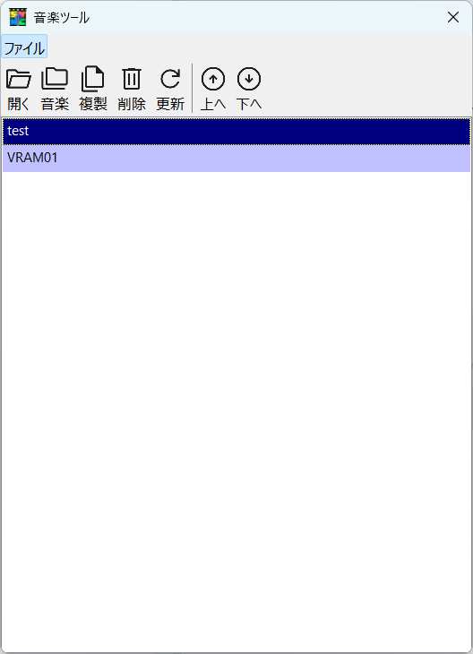
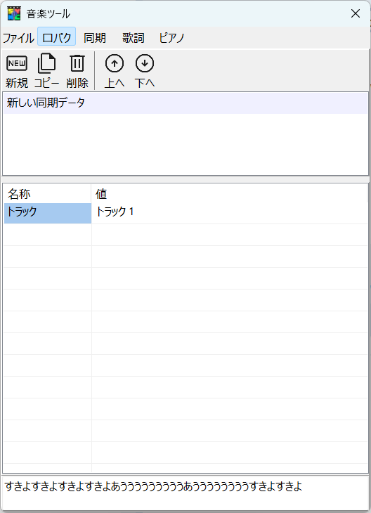
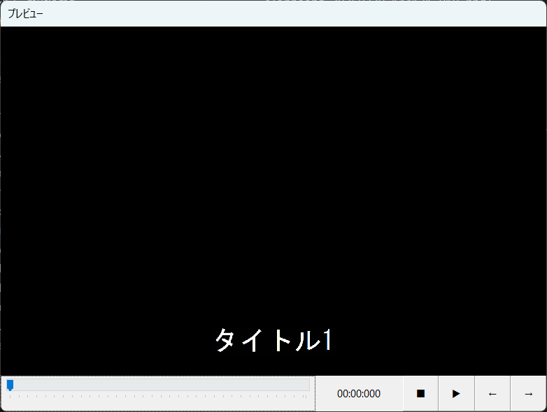
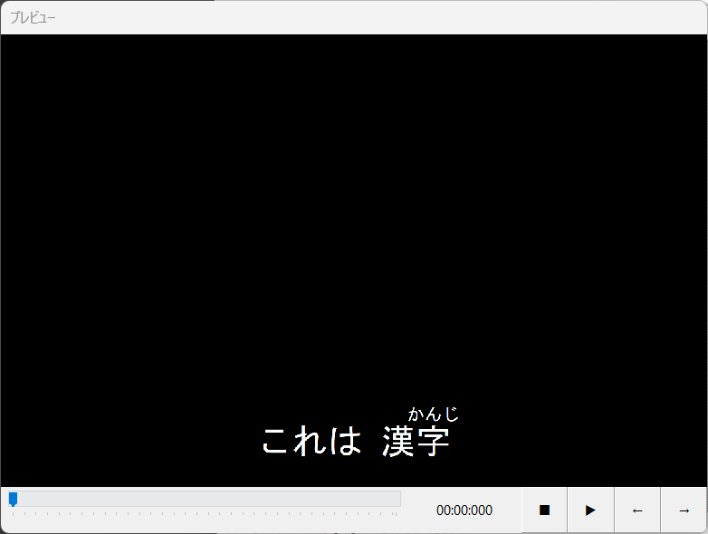
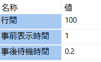
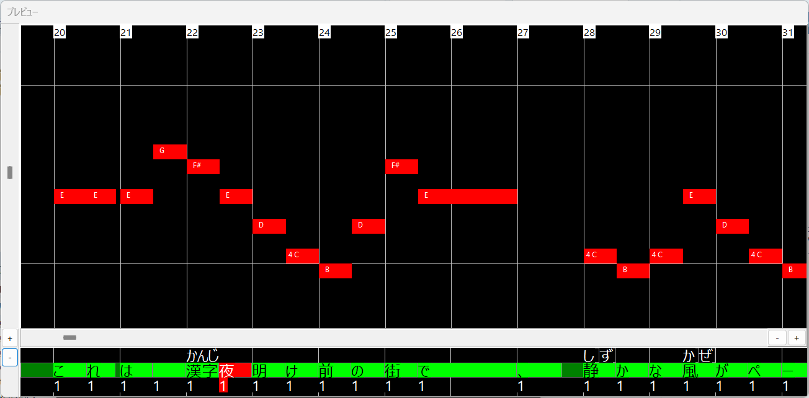

# 音楽

音楽には様々な機能があります。
まずはプロジェクトファイルを開きます

タブよりファイルを選択するとプロジェクトがリストで表示されます。
新規プロジェクトを作成する場合は「開く」で音楽ファイルを開いてください。

## 開く
音楽ツールで使用する音楽ファイルを選択します。選択すると新規プロジェクトとして追加されます。
デスクトップ版の新旧朗2の場合はアプリに音楽ファイルをドロップすることでも登録できます。
### 対応音楽ファイル

対応音楽ファイルは下記のようになっています。
これらは一般的な音声合成ソフトによって歌唱データを生成するアプリから保存出来る形式です。
- `mid`
- `vsqx`
- `ust`

## 音楽
選択しているプロジェクトの音楽ファイルを選択し直します。
後術する複製と組み合わせて使用すると便利です。

## 複製
プロジェクトを複製します。
複製したあとに音楽を選択して音楽ファイルを選択し直すことで、プロジェクトの設定を毎回作る事無く、別の音楽ファイルの設定に流用できます。

## 削除
プロジェクトから登録を消します。
ファイルは削除されません。

## 更新
音楽ファイルを更新した場合、更新操作で再度読み込まれます。

## 音楽の機能
音楽ツールには下記の様な機能があります。
- [口パクソング](#lip-sync-song)　立ち絵を歌わせます。
- [同期](#sync)　あらかじめ作っておいたグループ制御などを音楽に合わせて配置します。
- [歌詞テロップ](#lyrics-telop)　カラオケの歌詞テロップを表示します。
- [ピアノロール](#piano-roll)　ピアノとノートが表示されアニメーションします。

## 口パクソング

立ち絵ツールで「口パク（トーク）」にて　あいうえおん　と　通常時の口のパターンを設定しておくとあとは　「新しい同期データ」をAviUtl2にD&Dするだけで完了します。

音楽データに複数のトラックがある場合、トラックの設定でトラックを指定します。そのトラックに歌唱データが存在するかどうかは最下段に歌詞が表示されるかどうかで確認します。

### 歌唱データとは？
歌わせることができるアプリから出力されるファイルには歌唱データが含まれています。
新旧朗2の口パクソング機能はこの歌唱データを利用して口パクをしています。

### 立ち絵オブジェクトの設定

AviUtl2の新旧朗2の立ち絵オブジェクトの設定で　口パク（ソング）の参照レイヤーを口パクソングオブジェクトデータを配置したレイヤーと合わせる必要があります。

### 口パク（トーク）と口パク（ソング）の関係
口パク（ソング）は曲の開始から終わりまでを1つのオブジェクトとしているため、歌わせる前や間奏、歌い終わった後などにセリフをしゃべらせる使い方を想定して、口パク（ソング）より　口パク（トーク）を優先しています。
それぞれ別のレイヤーを参照させ、口パク（トーク）参照レイヤーにセリフオブジェクトを参照させると口パクアニメーションが行われます。

## 同期

音楽に合わせてキャラを動かせたい場合、動きをあらかじめグループ制御などに割り当てます。
そのグループ制御を「エリアス」として保存、または新旧朗2のエクスプローラーで保存してください。

保存したエリアスファイルを「オブジェクト」として設定します。
トラックに同期させたいトラックを同期モードとして同期の種類を、配置レイヤーにAviUtl2に出力するレイヤー番号を指定します。

※この機能はまだ未実装です。

## 歌詞テロップ

カラオケのような表示を再現できます。
音楽に合わせて表示され
音楽のタイミングに合わせて色が変わります。

## 歌詞
歌詞を入力します
ここでの1行が表示される1行になるので文字サイズなどに合わせて改行位置を調整してください

表示の目安としてプレビュー画面が表示されます。

### 歌詞の特殊記号

歌詞は特殊記号を設定することによりルビ（ふりがな）を表示することが出来ます。

半角の()の中にふりがなを入れることで、カッコの前の文字に対するルビに設定することが出来ます。

（例）
静(しず)かな風(かぜ)がページをめくる。

ふりがなを付けたい対象の文字が2文字以上の場合、()だと直前の文字「字」のルビと判断されてしまいます。

（例）
これは 漢字(かんじ)

このような場合はふりがなを付けたい対象の文字を[]でくくります。

（例）
これは [漢字] (かんじ)

歌詞に半角のカッコを使いたい場合は「\\(」とすることで特殊記号では無くなります。
「\\」自体を使いたい場合は「\\\\」と2個連続で記述します。
歌詞が完成したら次に同期を設定します。

## 同期

歌詞1行毎に音楽と同期を合わせます。
同期の前にまず歌詞を表示させる行を指定します。
### 行の設定

初期値は「1行目」です。
画面最下行が1行目で、2行目がその上と逆方向なことに注意します。
行は1から5までの数字キーのほかに「+」で上へ「-」で下方向に移動させることが出来ます。
プレビュー画面を見ながら設定します。

### トラック
音楽データのどのトラックに同期するかを指定します。

### 標準
1行毎に設定と編集を行うモードです。

### 詳細
1文字ごとに設定と編集を行うモードですが未実装です。

### 装飾

歌詞のフォント、フォントサイズと文字色（変更前、変更後）を設定します。

### 色

色は16色以外に　RGB値を直接入力することが出来ます。

### 行の設定

行に関する設定を行います。

行間：行と行を開けるピクセル値を指定します。
事前表示時間：歌詞は音の同期より前に表示します。その事前時間wの秒で設定します。
事後待機時間：同期し終わったあとで歌詞表示を維持する時間を秒で設定します。

## 音との同期

音との同期はピアノロールプレビューを見ながら設定します。
上から順にメロディのピアノロール表示、ふりがな、同期中の歌詞、同期設定値になります。
暗い緑の部分は事前表示、緑の部分が歌詞で選択中の文字は赤色になります。

歌詞を選ぶとプレビューの表示フレーム位置も変わります。この状態でCtrlやShiftと左右を使って音楽と同期を行います。

左右：選択する文字を移動します。
Ctrl+左右：同期設定値を増減させます。
Shift+左右：同期タイミングを早めたり遅めたりします。

### 同期設定値とは？
同期設定値とは初期値で1となり1文字が1音に対応します。2は1文字2音、3は1文字で3音分となります。
0を設定するとその文字は音と同期しない設定となります
マイナス方向は -1で　2文字で1音 -2で 3文字で1音と1音で同期させる文字数が増えていきます。

### 装飾
本来は文字ごとに装飾の設定を変えることが出来るのですが未実装となっています。

### 行設定
本来は行ごとに行の設定を変えることが出来るのですが未実装となっています。

## 送信
完成した歌詞テロップデータをAviUtl2に送信します。
デスクトップ版の場合はリストの表示をAviUtl2へD&Dします。

## AviUtl2による設定
AviUtl2の歌詞テロップオブジェクトを選択すると必要な設定を行う事が出来ます。
フォント以外は対応しています。

※フォントはAviUtl2フィルタープラグインから使えません。

## ピアノロール
